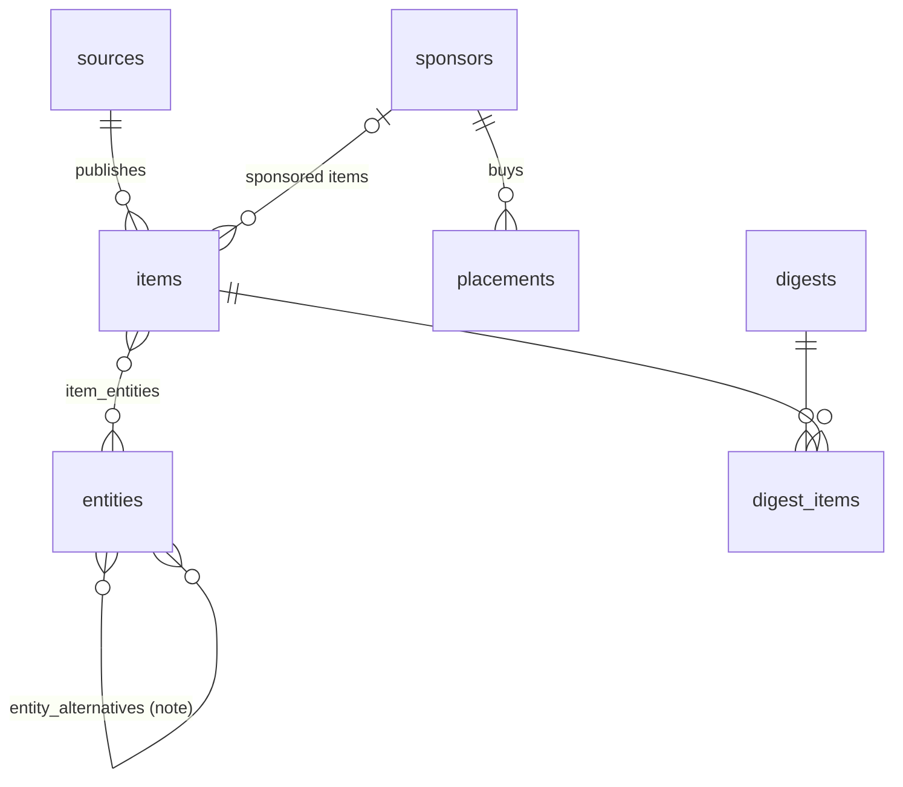
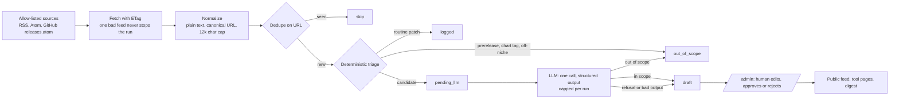

# 02 Product shape, stack, schema, ingestion, pages

| | |
|---|---|
| Status | Built as starter code in this folder; DB path verified locally, LLM call not yet run live |
| Date | 2026-10-06 |
| Owner | CT |
| Audience | CT, and whoever runs this next |

## Product shape

1. A **vendor-neutral registry** of platform-engineering tools, platforms, MCP servers and recurring reports, each with release history, short comparisons and linked case notes.
2. A **rolling feed** of what shipped, each entry tagged by category and impact, summarized in plain English with a separate "for platform teams" line.
3. A **weekly digest** assembled from the week's approved entries, with a hand-written intro.
4. **Software drafts, a person publishes.** Ingestion only extracts and drafts; nothing is public until it is approved in `/admin`.
5. **Scope is narrow on purpose**: IDPs and portals, AI agents operating on the platform, CI/CD, observability, supply chain, cost and governance, and DX data. No model releases, no consumer AI.
6. **Sponsorship is designed in, not bolted on**: a typed placement with its own slot, label and conflict rules.
7. Public, read-only, no accounts. One basic-auth admin path.

## Stack

| Layer | Choice | Why, and the trade-off |
|---|---|---|
| App | **Next.js 16 (App Router), TypeScript** | Server components query the DB directly, so there is no API layer to build. Costs: framework churn (16 already renamed `middleware` to `proxy`). |
| DB | **Postgres + Drizzle** (Railway or Neon) | The cron job and the web host both need the same DB over the network, which rules out a SQLite file on one box. Postgres arrays + GIN index handle multi-category filters. Drizzle `push` means no migration files until the schema settles. |
| Jobs | **GitHub Actions cron**, every 3 hours | Free, logged, holds secrets, no queue or worker to run. Costs: cron start times drift by minutes, and GitHub disables scheduled workflows after 60 days with no repo activity. |
| LLM | **One structured-output call per candidate item**, Anthropic SDK, `claude-opus-5-5` at `low` effort | Output is validated against a zod schema, so the model fills fields and never writes markup or chooses links. Hard cap of `MAX_LLM_CALLS_PER_RUN` (default 40). The whole integration is `src/ingest/summarize.ts`; swapping provider touches one file. |
| Hosting | **Railway** (web + Postgres in one project) | Matches the boring-TypeScript default. Vercel works too if the DB is Neon. |
| CSS | One hand-written stylesheet | Ugly but readable. No Tailwind until it is useful. |

**LLM cost, `[estimate]`**: ~3k input and ~500 output tokens per item. On `claude-opus-5-5` ($4 / $20 per MTok) that is about **$0.02 per item, roughly $30 a month at 50 items a day**. Setting `LLM_MODEL=claude-haiku-4-5` ($1 / $5) cuts that to about $8 a month; the code already handles Haiku's different parameters. That call is yours. Measure on a week of real drafts before deciding, because the cost that matters is per *approved* entry, including the ones you rewrite.

## Data schema

Full definition: [`src/db/schema.ts`](../src/db/schema.ts). Vocabularies live once in [`src/lib/taxonomy.ts`](../src/lib/taxonomy.ts).

| Table | Holds | Key decisions |
|---|---|---|
| `sources` | The allow-list: RSS/Atom feeds and GitHub repos | `tier` (primary, community, media, vendor) drives editorial weight. `keyword_filter` turns on the prefilter for broad feeds. ETag and Last-Modified stored for polite polling. |
| `entities` | The registry | `description` and `practical_notes` are human-written; the seed never overwrites notes. |
| `entity_alternatives` | One-line comparisons | Stored in both directions so either page shows it. |
| `items` | Every fetched URL, in every state | **Release history and case notes are not separate tables**: they are items filtered by `kind` and linked through `item_entities`. One row per canonical URL is the dedupe. `llm_raw` keeps the full model output for audit. |
| `sponsors`, `placements` | Future revenue | `conflict_entity_slugs` keeps a sponsor off pages for products it sells or competes with. |
| `digests`, `digest_items` | What went out each week | Intro is human-only. |

**Item lifecycle**: `pending_llm` (passed prefilter) -> `draft` (summarized) -> `approved` or `rejected` (human). Side exits: `out_of_scope` (prefilter or model said no; kept so it is never refetched) and `logged` (routine patch release: version, date and link only, shown on the tool page, never in the feed, no generated text).

## Ingestion flow

What each guard is for:

- **Allow-list only.** No URL is fetched unless it is a `sources` row.
- **Plain text only.** Feed HTML is stripped before storage, so no markup from a source reaches the page; React escapes everything rendered.
- **Deterministic triage before the model.** Found against real feeds on 2026-10-06: Backstage ships weekly `-next.N` pre-releases, Argo CD cuts the same patch on three branches at once, Crossplane and Kyverno publish chart and API-module tags. All filtered without a model. Patch releases that mention a CVE or security still go to the model.
- **The model sees source text as declared, untrusted data.** It cannot choose a URL, can only link entities from the list it is given (enforced again in code), and its output is a draft. The worst a poisoned feed item can do is produce a bad draft that you reject.
- **Failure goes to a human, not to the bin.** A refusal or schema failure becomes a draft flagged `llm_failed` with no generated text.

## Pages

| Route | What it shows | Notes |
|---|---|---|
| `/` | Feed of approved items, newest first; category chips; Major only, Releases, Case studies, Postmortems toggles | One sponsored slot after the fifth item, labelled, only when a placement is active |
| `/tools` | Registry grouped by category | |
| `/tools/[slug]` | Description, practical notes, release history (summarized and logged), alternatives with one-line notes, case notes and incidents, other coverage | The SEO page. Sponsor sidebar honours conflicts |
| `/about` | Methodology, impact definitions, sponsorship policy, corrections | Public version of [04](04-editorial-rules.md) |
| `/admin` | Review queue with editable fields, the "model said out of scope" list to catch false negatives, manual add form | Basic auth in `proxy.ts`, re-checked inside every server action |
| Digest | `npm run digest` prints Markdown for the newsletter tool | Deliberately not a page in v1 |

## Sponsorship, designed for later

- **Sponsored items are a `kind`, not a style.** They never get an impact tag, never appear in "Major only", and always render with a Sponsored label and `rel="sponsored"`.
- **Placements are slot-based** (`feed_inline`, `digest_top`, `entity_sidebar`), optionally targeted by category, time-boxed.
- **Conflict rule in data**: a sponsor's placement is never shown on the page of an entity in its `conflict_entity_slugs`.
- What to sell first, when there is an audience: the digest slot. It is one placement a week and needs no ad tech.
